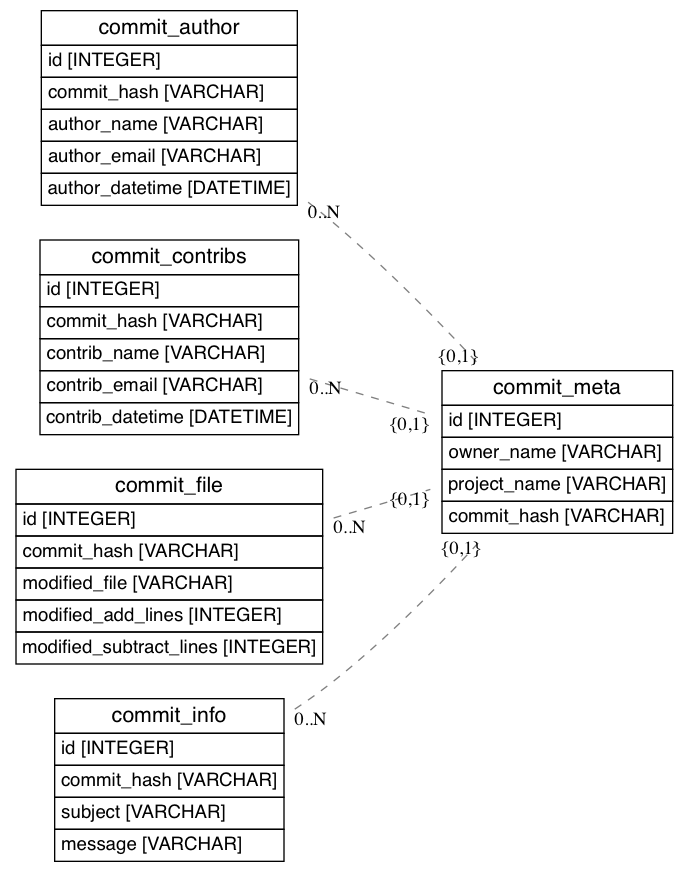

```{r, include=FALSE}
library(knitr)
```

Assignment 2 requested that we create a database schema and prototype
the designed schema by generating SQL to create our database specifications.

# Schema

I tried to closely adhere to the higher level schema specifications 
provided by Assignment 2. It's unclear to me whether I can use the
approach taken in these assignments so I didn't want to add extra
tables/fields to the database. The intuition behind my approach is
to consider my data operations in terms of a directed acyclic graph (DAG).
I thought about which information I would need first, second, etc. I
tried to use this DAG approach when creating my database schema.

My database schema approach is to create a parent table, `commit_meta`,
with four child tables: `commit_author`, `commit_contribs`, `commit_file`,
and `commit_info`. The idea is that if you need to join a table, you will
always need the parent, and sometimes need to include the children. Figure 1
contains an ERM model of the database. 

{width=300px}

Here is my thinking behind each individual table:

* `commit_meta`
  - Include information which should always be relevant when joining tables
  - Use *commit_hash* as a Foreign Key across all tables
* `commit_author`
  - You will sometimes need information about the author but not always 
	so I treat this as a separate entity.
  - Index on *commit_hash* and *author_name*. Seems like it would be the
	most commonly referenced attributes
* `commit_contribs`
  - There may be multiple contributors per commit.
  - Foreign Key is still *commit_hash*
  - Tries to just store identifying information about a contributor
* `commit_file`
  - There will often be multiple files per commit
  - Foreign Key is *commit_hash*
  - Contains modified file, number of lines added, number subtracted
* `commit_info`
  - This enity stores information about the commit such as subject and message

The DAG approach is meant to ensure one-to-many joins. We can
still have a many-to-many scenario if joining `commit_file` and
`commit_contribs`, for example. 

# Prototype

Prototyping is handled by `okra`, the Python package I wrote during our
last assignment. I'm using SQLAlchemy [@SQLAlche46] behind the scenes
to generate my database schema in a way that's compatible with multiple
databases. SQLAlchemy is a database toolkit used at Yelp, Reddit, DropBox,
and Survey Monkey. My ERM Diagram was generated from my SQLAlchemy metadata
using the "eralchemy" Python package [@Alexisbe3]. 

The SQLAlchemy is nice for setting up a database schema because the approach
is compatible across multiple types of databases such as SQLite and PostgreSQL.
My implementation simply requires you to include a database url. The database
doesn't even need to be set up, I generate everything using a mock connection.

You'll notice a configuration file, "populate/schema-okra-playbook.yml". I've
decided to adopt the Ansible approach [@Ansible] when configuring my data
processing jobs. There's a lot of pretty indepth data pipeline approaches 
available but we learned last week that those are overkill. The existing
data pipelines are also expensive to run. I'm planning on trying the Ansible
approach to see if it generalizes well to data engineering.

# Discussion

A database schema was implemented using a DAG approach. The prototype
was created using a database toolkit for compatibility across SQL databases.
I've adopted the Ansible style of configuration to see if it generalizes
well to data engineering. Next week I'll need to spin up a database and
load it. 

# References
